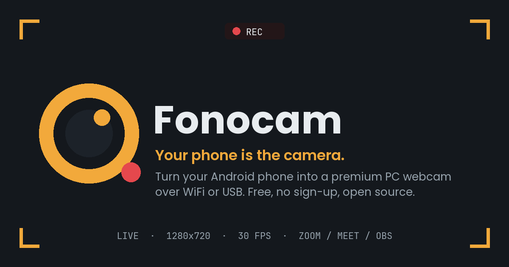

<div align="center">



<h1>Fonocam</h1>

<p><strong>Use your Android phone as a premium PC webcam — over WiFi or USB.</strong><br/>
A free, open-source DroidCam alternative for Zoom, Google Meet, Discord, Teams and OBS.</p>

<p>
  
  
  
  
  
</p>

<p>
  <a href="https://github.com/rahadalways/camconnect/releases/latest/download/Fonocam-Setup.exe"><b>⬇ Download for Windows</b></a>
  &nbsp;·&nbsp;
  <a href="https://github.com/rahadalways/camconnect/releases/latest/download/Fonocam.apk"><b>⬇ Download for Android</b></a>
  &nbsp;·&nbsp;
  <a href="https://rahadalways.github.io/camconnect/"><b>🌐 Website</b></a>
</p>

</div>

---

## ✨ Why Fonocam

Your phone already has a better camera than a $100 webcam. Fonocam puts it to work and gives you a full control room on the desktop — no cables required, no accounts, no watermark.

| | Feature | Detail |
|---|---|---|
| 🎥 | **Real virtual webcam** | Appears as a camera in Zoom, Meet, Discord, Teams and OBS |
| 📡 | **Zero-typing setup** | Phone auto-appears on the PC — no IP addresses or codes |
| 🔌 | **WiFi or USB** | Wireless around the room, or a cable for zero-drop low latency (bundled adb) |
| 🎛️ | **Desktop control room** | Rotate, mirror, flip, brightness, contrast, zoom, torch, quality — live |
| 🎞️ | **H.264 or MJPEG** | Hardware-encoded HD streaming with automatic fallback |
| 📼 | **Record on both ends** | PC records the processed stream; phone keeps a 4K + audio backup |
| 🪟 | **Floating facecam** | Rounded always-on-top mini window for screen recordings |
| 🔋 | **Runs in background** | Keeps streaming when you leave the app or dim the screen |
| ⬆️ | **In-app updates** | The phone app updates itself straight from GitHub |

---

## 🚀 Quick start

### 🖥️ Windows

1. Download **[Fonocam-Setup.exe](https://github.com/rahadalways/camconnect/releases/latest/download/Fonocam-Setup.exe)** and run it. On first launch choose **More info → Run anyway** (the app isn't code-signed yet).
2. Install **[OBS Studio](https://obsproject.com)** once — it registers the virtual-camera driver. You never have to open it.

### 📱 Android

Install **[Fonocam.apk](https://github.com/rahadalways/camconnect/releases/latest/download/Fonocam.apk)**, allowing installs from your browser. After that the app updates itself: **Settings → Check for update**.

### ▶️ Go live

1. Open Fonocam on the phone and press **Start**.
2. Open Fonocam on the PC — your phone is already in the list. Click **Connect**.
3. Press **Start Virtual Webcam** and pick **OBS Virtual Camera** in Zoom / Meet / Discord / OBS.

> **USB mode:** enable Developer options → USB debugging, plug in the cable, press **USB**. adb is bundled — nothing else to install.

---

## 🧩 Project layout

```
Fonocam/
├── app/                  📱 Android app (Kotlin, Jetpack Compose)
│   └── src/main/java/com/example/
│       ├── MainActivity.kt        UI
│       ├── StreamService.kt       foreground camera + server
│       ├── WebcamHttpServer.kt    HTTP stream + discovery
│       └── H264Encoder.kt         hardware H.264 encoder
├── Fonocam_Desktop.py    🖥️ Windows app (Python, CustomTkinter)
├── installer.iss         📦 Windows installer (Inno Setup)
├── web/                  🌐 Landing page (React + Vite + Tailwind)
└── .github/workflows/    ⚙️ CI: builds APK + EXE, deploys the site
```

---

## 🛠️ Tech stack

| Part | Built with |
|---|---|
| **Android** | Kotlin · Jetpack Compose · CameraX · MediaCodec (H.264) |
| **Desktop** | Python · CustomTkinter · OpenCV · PyAV · pyvirtualcam |
| **Website** | React 19 · Vite · Tailwind CSS v4 · Phosphor icons |
| **CI / CD** | GitHub Actions — signed APK, one-file EXE + installer, GitHub Pages |

---

## 🏗️ Building from source

Every push to `main` builds a **signed release APK**, a **Windows installer + portable EXE**, and deploys the **website** — all on GitHub Actions, no local SDK required.

<details>
<summary>Build locally</summary>

```bash
# Website
cd web && npm install && npm run build

# Desktop app
pip install customtkinter opencv-python pyvirtualcam pillow "numpy<2" av
python Fonocam_Desktop.py

# Android app — open the project in Android Studio and Run
```
</details>

---

## 🔒 Privacy

No account, no cloud, no tracking. Your video never leaves your local network — the phone streams directly to your PC over WiFi or USB.

<div align="center">
<sub>Built by Rahad · Fonocam — your phone is the camera.</sub>
</div>
